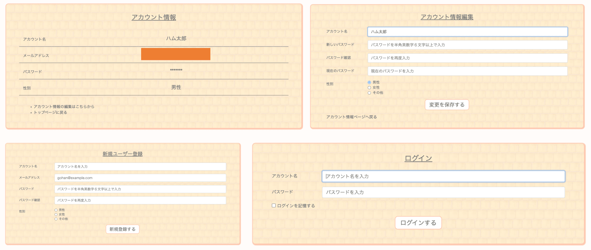
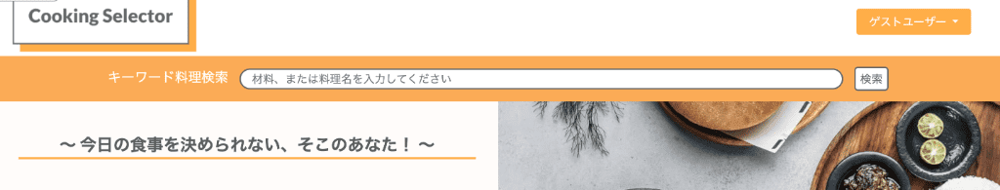
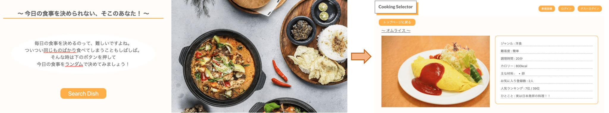
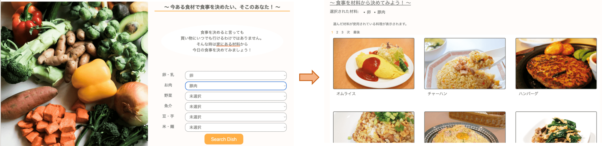
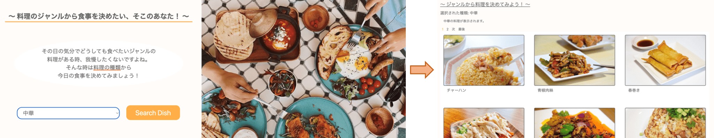
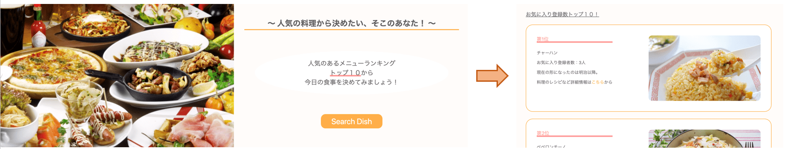
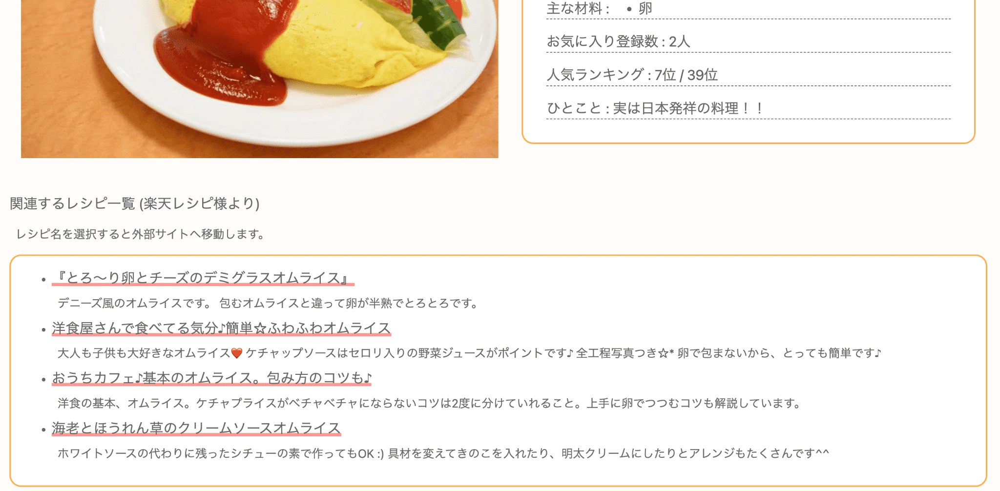
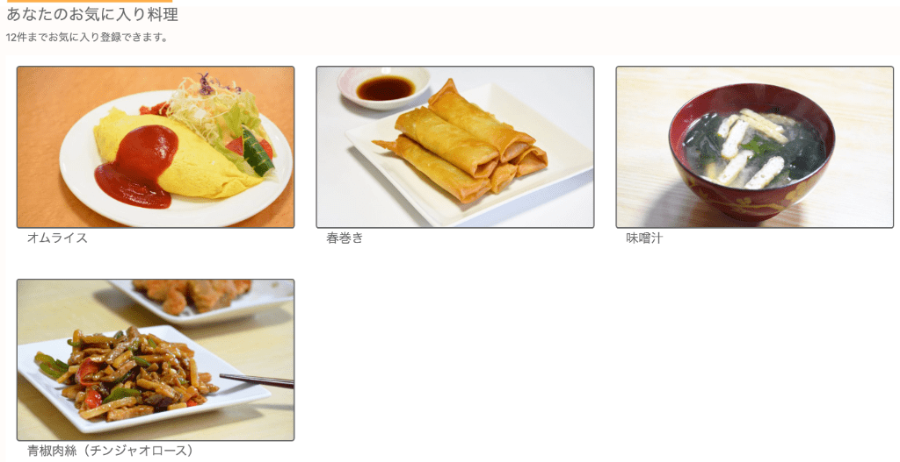
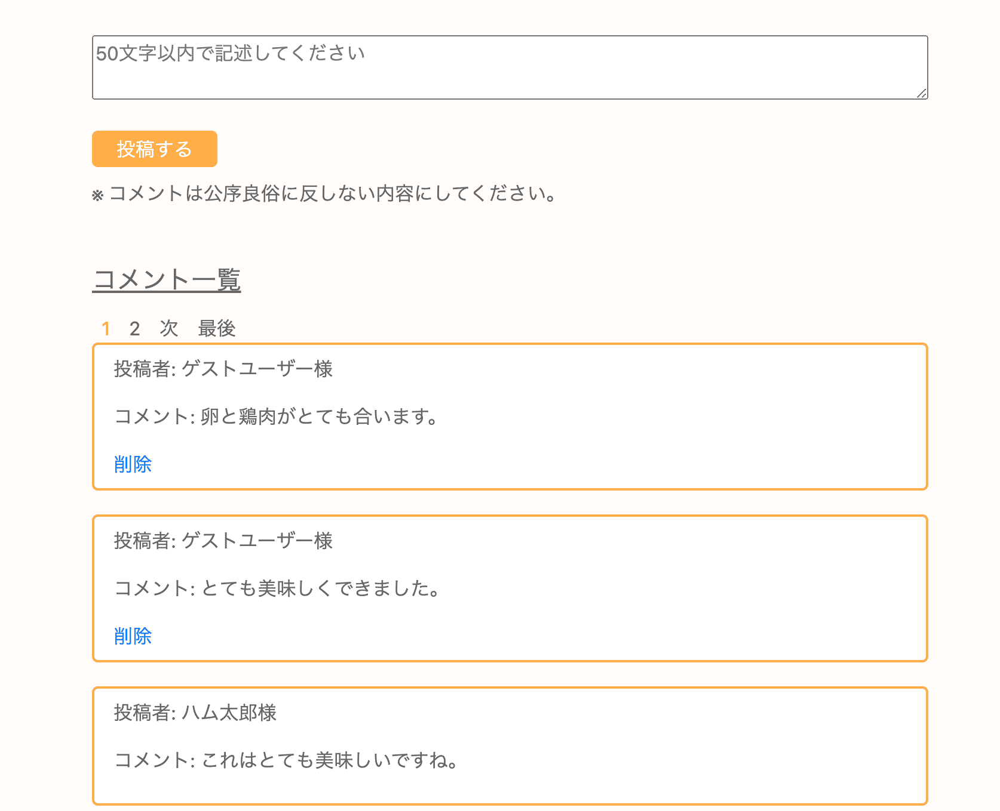
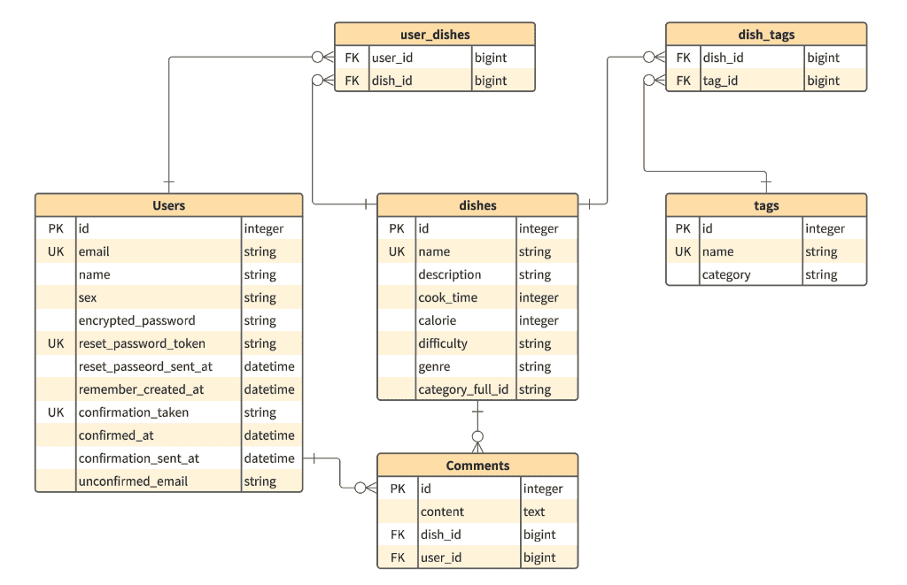

## 概要
毎日の食事を振り返ると、つい**同じものばかり**食べていませんか？

このwebアプリケーションでは条件をつけて検索を行い

選ばれた料理の内容とそのレシピへのURLを参照することができます。

様々な食事をして、健康な食生活を続けましょう。

レスポンシブ対応しているため、スマートフォン、タブレットでもご利用いただけます。

## URL
https://cooking-selector-5ef1831c3338.herokuapp.com/

**ログインをしなくても**、一部機能を除き、当サイトを利用することができます。

※ユーザーのお気に入り料理機能、コメント機能の利用にはログインが必要となります。

## 使用技術
- Ruby 3.1.0
- Ruby on Rails 
- MySQL 8.0
- Docker / Docker Compose
- RSpec
- Github
- Amazon S3
- Heroku
- Mailgun
- 楽天レシピカテゴリー別ランキングAPI

## 機能一覧
- #### ユーザー登録、ログイン機能 (devise)
    ユーザーの登録、編集、削除、ログイン、ログアウト機能を実装。  
    また、ユーザー登録にはメール認証を必要としています。  
    
- #### 料理検索機能
  - #### キーワード検索機能
    料理名および材料名によるフリーワード検索ができます。  
    未入力で検索した場合、全料理が表示されます。  
    
  - #### ランダム検索機能
    ランダムで選ばれた料理とレシピが表示されます。  
    
  - #### 材料別検索機能
    カテゴリー別で材料を選択し、選ばれた材料が使用されている料理が表示されます。  
    表示された料理を選択すると、詳細ページ（料理情報とレシピが記載）へ移動します。  
    
  - #### ジャンル別検索機能 (ransack)
    和食などジャンルを選択すると、条件に合った料理が表示されます。  
    表示された料理を選択すると、詳細ページへ移動します。  
    
  - #### ランキングトップ１０
    ユーザーのお気に入り数によるランキングトップ１０を表示しています。  
    
- #### ページネーション機能 (kaminari)
    材料検索、ジャンル検索、キーワード検索の際、１ページあたり条件に合う6件の料理が表示されます。
- #### レシピURL表示機能 (楽天レシピカテゴリー別ランキング)
    料理詳細ページにて、関連するレシピURLとその概要が4つ表示されます。
    
- #### お気に入り料理機能
    ログインしている場合、料理詳細ページにてお気に入り追加ボタンを表示させ、  
    クリックするとお気に入り料理に追加させることができます。  
    料理詳細ページにお気に入りとして何件登録されているか、またそれに基づく人気ランキングの順位も表示させています。  
    ランキングにてお気に入り件数が同数の場合、そのうち新しく追加された料理を上位にしています。  
    ユーザーがお気に入り登録した料理一覧を表示するページも実装しております。  
    ユーザーあたり12件までお気に入り料理として登録できます。  
    
- #### コメント機能
    料理詳細ページにてコメントが投稿できます。コメントを投稿したユーザーのみ、削除ができます。  
    コメント投稿にはログインが必要となっております。１ページ5件までコメントは新しいものから表示されます。  
    ログインしていないユーザーもコメントの閲覧はできます。  
    
- #### 管理画面 (Active Admin)
    Active Adminを使用した管理画面を実装しています。
- #### 画像保存 (Amazon S3)
    Active Storageを使用したアップロード機能を実装しました。本番環境ではAmazon S3に保存するようにしました。

## テスト
- #### RSpec
  - システムテスト(System Spec)
  - 統合テスト(Request Spec)
  - 単体テスト(Model Spec)
  - ヘルパーテスト(Helper Spec)
- #### RuboCop

## ER図

## 今後の計画
- CircleCIの導入を進めようと考えています。
- 別のアプリケーションにて行うかもしれませんが、AWSに関心があるため、学習の一環として  
  本番環境をherokuではなくAWSにて構築しようと考えています。
